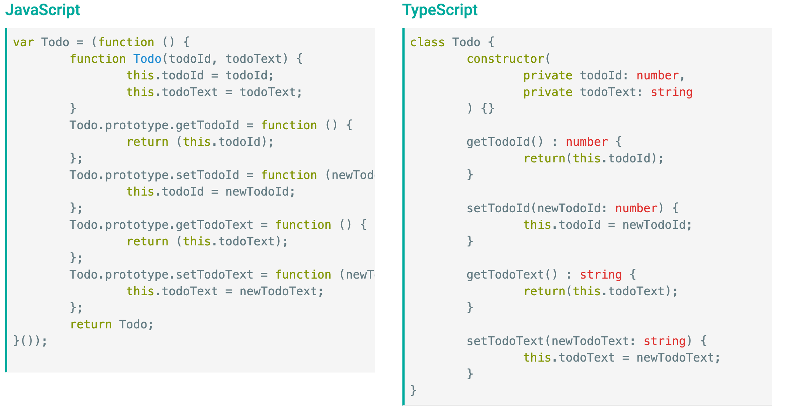

# Typescript
- [The Story of TypeScript](https://www.youtube.com/watch?v=EUlM3wx546o)
- Typescript is a strongly typed superset of JavaScript that transpiles into plain JavaScript
- transpile - convert one language into a similar language
- Javascript can be run everywhere, but Typescript can't, so we want our end product to run in JS
- Typescript uses the same syntax JavaScript developers know - no need for new language
- Typescript incorporates  standard OOP paradigms and cutting edge javascript features

Features include
- Strict type checking
- no more worrying if 1 == 'one' == '1' == [1] etc. (all evaluate to false)
- Fancy object-oriented abilities - Mixins/Traits and Interface support
- we don't use these in the bootcamp, but lots of other places do
- For a five minute intro to Typescript checkout [Typescript handbook](https://www.typescriptlang.org/docs/handbook/2/everyday-types.html)